#  최적 물류센터 위치 제안 프로젝트  
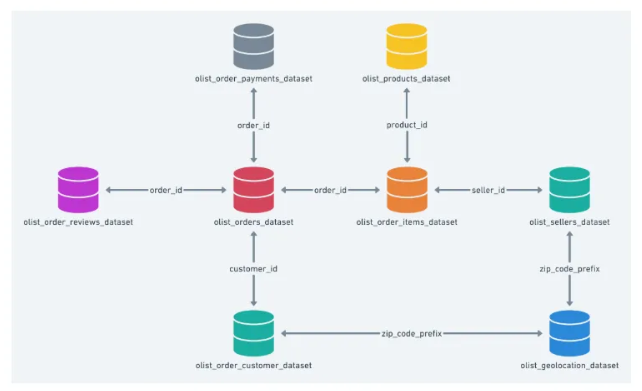  
브라질 Olist 데이터를 활용한 소비자 만족도 개선 전략  

---

##  프로젝트 정보

| 이름       | 역할                                                         |
|------------|--------------------------------------------------------------|
| **양현우** | DW 및 데이터 마트 설계, 데이터 전처리, NLP, 머신러닝         |
| **박병제** | 데이터 시각화, 회귀분석, 도메인 리서치                        |
| **김민주** | 데이터 시각화, EDA, 도메인 리서치,기획 및 문서화 리드                             |

> 본 프로젝트는 **데이터리안 실전반 37기 데이터 분석 프로젝트**로 진행되었습니다.

---

##  프로젝트 개요

### ▪️ 문제 정의
- Olist 이커머스 데이터를 분석한 결과, **배송 지연**이 소비자 만족도 하락의 핵심 원인으로 도출됨.
- 리뷰 분석 결과, 배송 소요 기간이 리뷰 점수에 **직접적인 영향**을 미치는 것으로 나타남.
  
### ▪️ 목표
- 리뷰 및 배송 데이터를 분석하여, **고객 만족도에 영향을 주는 주요 변수 도출**
- **배송 지연 해결을 위한 최적의 물류센터 위치 제안**, 개선 효과를 **정량적으로 수치화**
여기 아래는 요청하신 내용을 **마크다운 형식 그대로** 정리한 버전이야. 바로 복붙해서 사용할 수 있어:

---

##  기술 스택 및 활용 방식

| 도구/기술      | 활용 내용                                                                 |
|----------------|---------------------------------------------------------------------------|
| **Python**     | 데이터 전처리, 머신러닝(NLP/회귀 분석), 시각화 기반 분석 수행              |
| **PySpark**    | 데이터 정제 및 DW/데이터 마트 설계, 대용량 주문 데이터 전처리 및 처리 효율화 |
| **Pandas**     | EDA 및 통계 분석, 전처리 보완, 시각화                                     |
| **Spark SQL**  | 테이블 간 조인 및 집계, 배송 지연 분석 등 SQL 기반 효율적 분석 수행       |
| **Tableau**    | 주요 분석 결과 및 인사이트 시각화                                         |
| **Docker**     | 환경 컨테이너화, 재현 가능한 분석 환경 구축                               |

---

##  데이터 구조 및 설계 철학

### ▪️ 설계 개요
- 원본 데이터는 중복 및 결측, 비정규화 → **분석/모델링 비효율적**
- **Fact / Dimension / Mart 테이블 분리**로 **분석 최적화 및 확장성 확보**

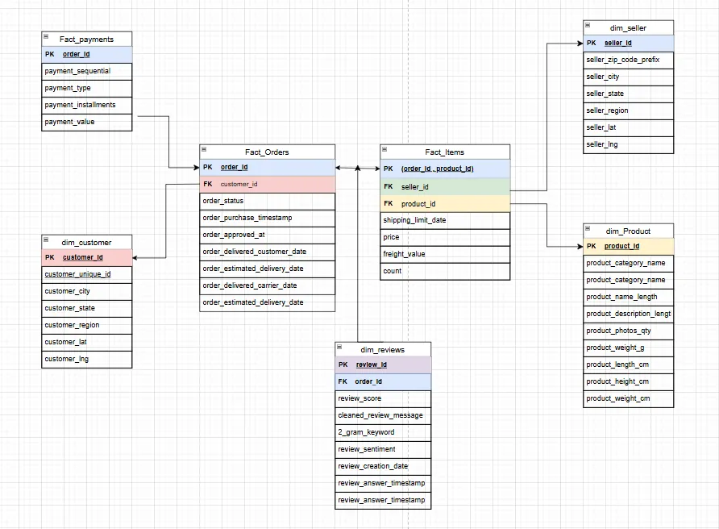  
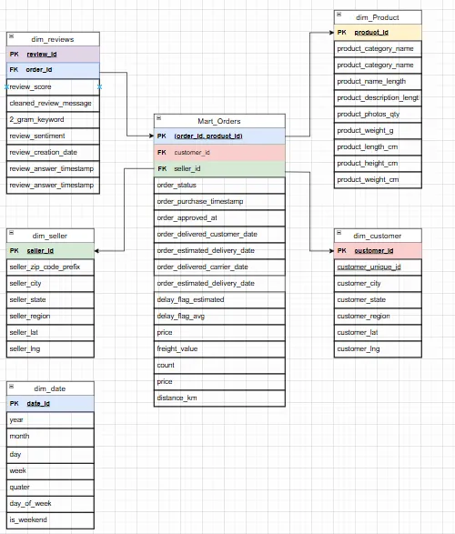

| 테이블명           | 설명                                                        |
|-------------------|-------------------------------------------------------------|
| `dim_seller`      | 판매자 정보 통합. 위경도, 지역 기반 분석                   |
| `dim_customer`    | 고객 정보 통합. 거리 계산 및 지역 분석 목적                 |
| `fact_orders`     | 주문 중심 데이터. 배송 상태, 지연 여부                     |
| `fact_items`      | 상품별 가격, 배송 마감 기한, 수량                           |
| `mart_orders`     | `fact_orders` + `fact_items` 통합.                           |
| `overall_mart`    | `mart_orders` + `dim_seller/customer` → 분석용 통합 테이블   |
| **`mart_review`** | 최종 테이블. `overall_mart` + 리뷰 데이터                   |

---

### ▪️ 설계 이유 및 기대 효과

| 설계 요소          | 설계 목적 및 고려 사항                                                              |
|-------------------|-------------------------------------------------------------------------------------|
| Fact 테이블 분리  | 주문 단위/상품 단위 데이터 분리로 확장성 및 모듈화 확보                             |
| Dimension 테이블  | 위경도 기반 거리 계산 및 지역 분석 용이                                              |
| Mart 테이블 설계  | 분석 효율성 위해 필요한 테이블만 선택적 조인 → 쿼리 최적화, 비용 최소화               |
| 최종 mart_review  | 리뷰 데이터 포함 비정형 텍스트 전처리 후 통합 → 머신러닝 및 텍스트 분석 최적화        |

✔️ 정규화 → 비정규화 설계로 Spark / SQL 환경에서 **조인 최적화 및 처리 효율성 증대**  
✔️ 분석 및 모델링 시 **데이터 가독성 향상**, **확장성 및 유지보수 용이**

---

##  리뷰 분석 및 배송 지연 문제 정의

### ▪️ 감성 분석 (RoBERTa 모델 활용)  
- 다국어 리뷰 감성 분석: Huggingface RoBERTa fine-tuned 모델 사용  
- 배송 관련 키워드 기반 감정 분석 → **긍/부정 리뷰 점수 차이 명확**  
  - 빠른 배송 리뷰 평균 **4.84점**
  - 배송 지연 리뷰 평균 **1.83점**

  
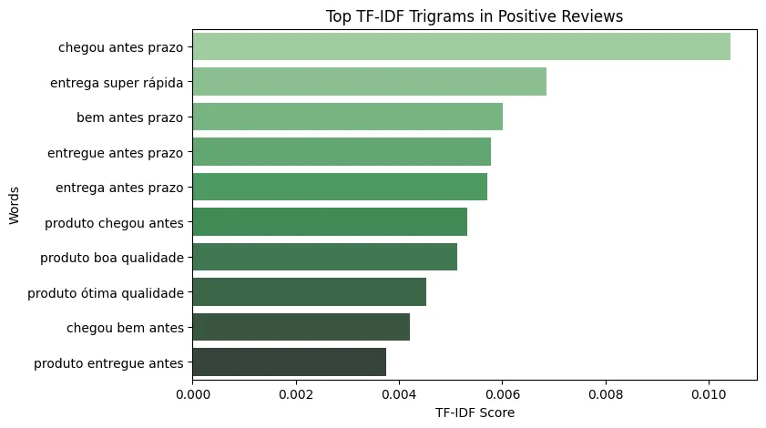  
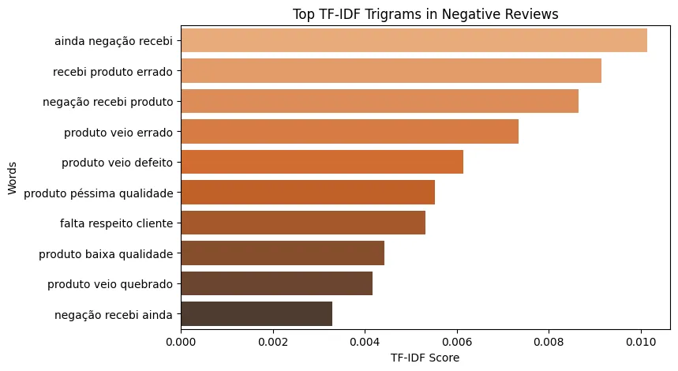

---

## 🚚 배송 소요 기간 분석

| 조건               | 평균 배송일 |
|--------------------|-------------|
| 판매자-고객 동일 주 | 7.9일       |
| 서로 다른 주       | 15일        |

- 판매자-고객 거리 및 물류 경로 → 배송 지연 핵심 요인  
- **북부/중서부 지역** 배송 지연 심각

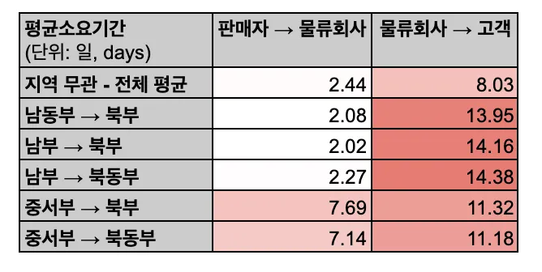  
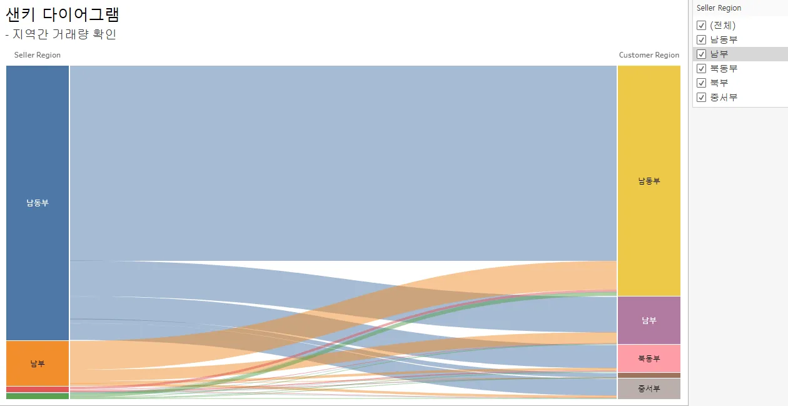

---

##  머신러닝 분석 및 변수 도출

### ▪️ 모델 및 분석 방식

| 모델               | 특징 및 활용 목적                                         |
|--------------------|----------------------------------------------------------|
| TabNet             | 범주형+수치형 혼합 데이터 최적화, 딥러닝 기반 해석력 확보 |
| Random Forest      | 변수 중요도 직관적, 해석 용이                             |
| XGBoost, LGBM      | 예측 성능 및 변수 해석력 탁월                             |

### ▪️ 주요 변수 중요도

| 변수                   | 설명                                        | 중요도 |
|------------------------|---------------------------------------------|--------|
| `carrier_to_customer`  | 물류회사 → 고객 배송 시간                   | ★★★★★ |
| `customer_lat/lng`     | 고객 위경도 데이터                         | ★★★★☆ |
| `freight_value`        | 배송비                                     | ★★★☆☆ |

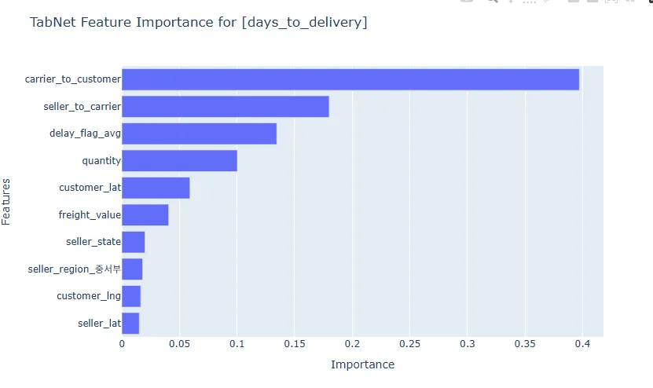  
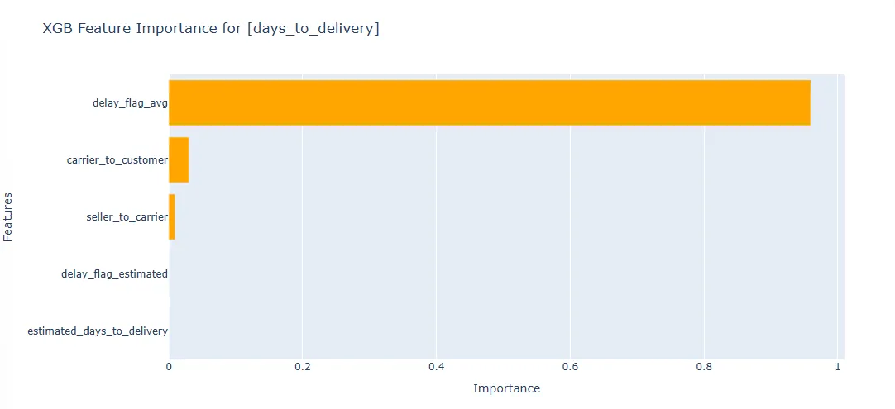  
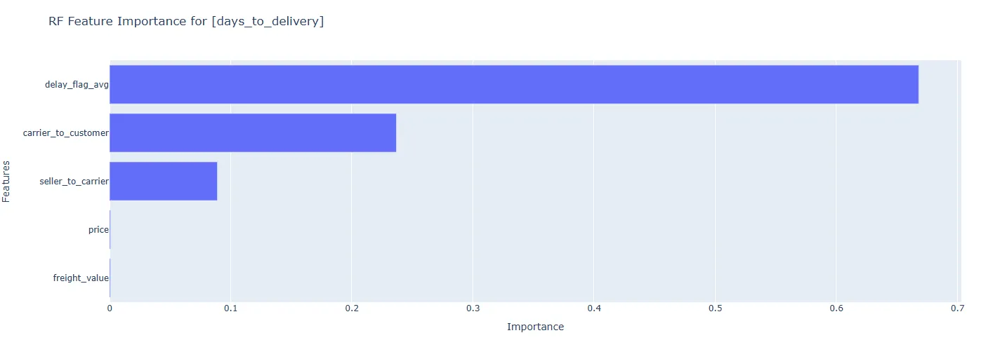  
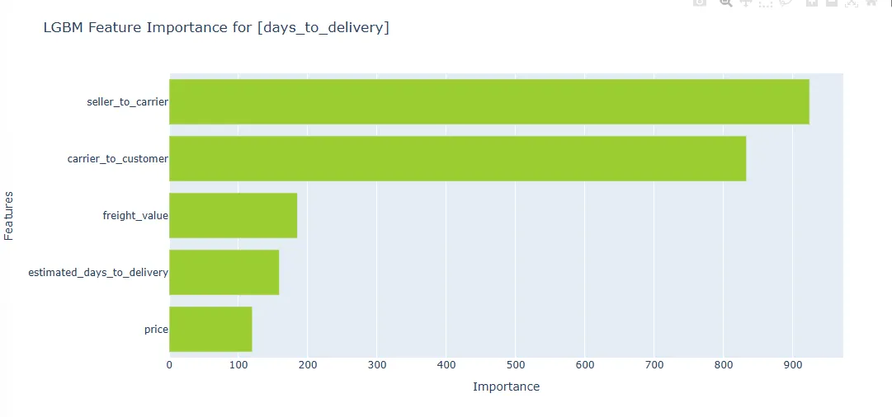

---

## 📍 물류센터 위치 최적화 및 효과

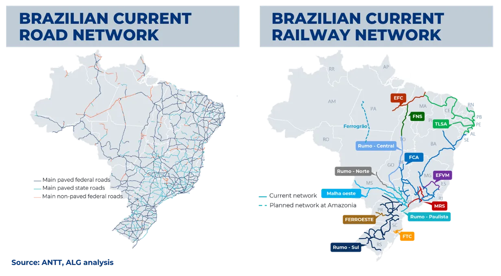

---

### ▪️ 최적화 로직 (KMeans + 군집 기반 접근)

1. 판매자와 고객의 위·경도 평균으로 **초기 허브 위치** 설정  
2. **주문 수량(quantity)을 가중치**로 거리 차이 최소화 → 물류 허브 최적화  
3. **Elbow Method**로 최적 클러스터 수(K=5) 결정  
4. KMeans 클러스터링으로 **최적 물류 허브 중심 좌표 도출**

---

### ▪️ 최적화 핵심 코드

```python
# Elbow Method로 K값 결정
for k in range(2, 15):
    kmeans = KMeans(n_clusters=k).fit(optimized_coords)
    wcss.append(kmeans.inertia_)

# 최적 K 적용 후 클러스터 중심 좌표 추출
kmeans = KMeans(n_clusters=5)
df['cluster'] = kmeans.fit_predict(df[['customer_lat', 'customer_lng']])
cluster_centers = kmeans.cluster_centers_
```
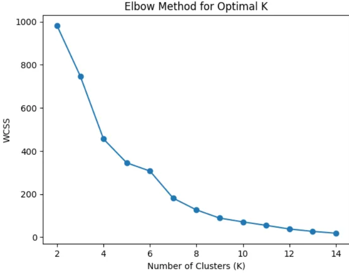


---

### ▪️ 최종 물류 허브 중심 좌표 (K=5 기준)

| 클러스터 | 위도(Lat)       | 경도(Lng)       |
|----------|-----------------|-----------------|
| 1        | -21.2264        | -43.0738        |
| 2        | -14.8082        | -50.7902        |
| 3        |  -7.6275        | -39.2443        |
| 4        | -27.2574        | -50.9832        |
| 5        | -23.0130        | -47.0728        |

---

### ▪️ 최적화 효과

| 비교           | 평균 배송일 |
|----------------|-------------|
| 기존           | 12.79일     |
| 최적화 후      | 11.60일     |
| 개선           | **1.19일 감소 (9.3%)** |

물류센터 위치 최적화 이전  
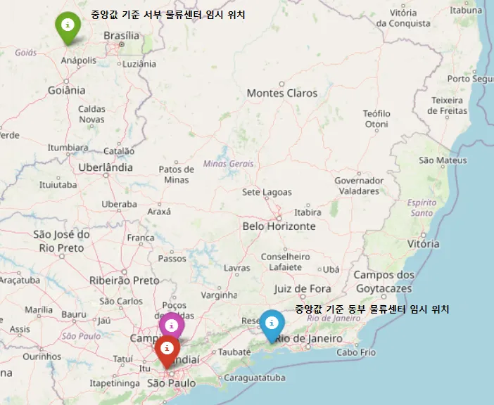

물류센터 위치 최적화 이후  
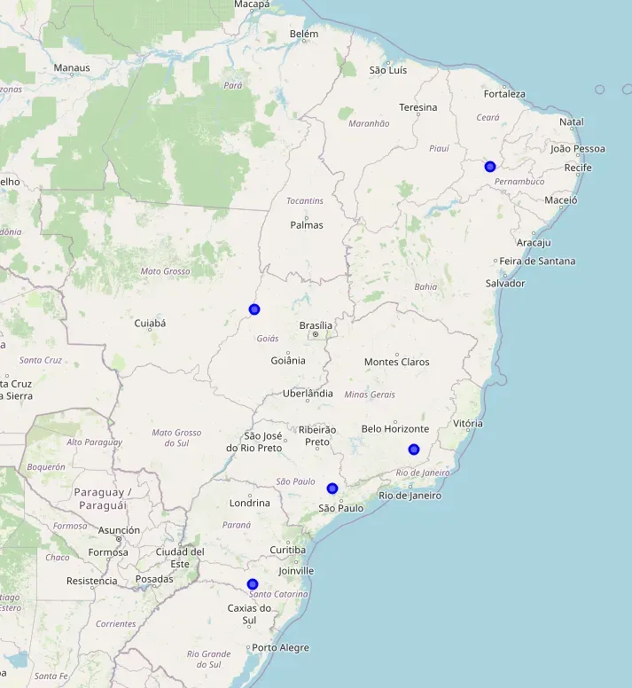

---

## 🛠️ 기술 스택 및 실행 안내

| 도구           | 활용 내용                                       |
|----------------|------------------------------------------------|
| Python         | 전처리, 분석, 머신러닝, NLP                     |
| SQL            | 데이터 정제 및 분석                            |
| Tableau        | 시각화 및 대시보드                             |
| Spark          | 대용량 데이터 처리 및 분석석                             |
| Docker         | 컨테이너 환경 관리 및 실행                     |

---

### 🐳 Docker 실행 방법

```bash
# 내 Docker Hub에서 이미지 다운로드
docker pull yanghyeonwoo/spark_olist:latest

# 컨테이너 실행
docker run -it --rm yanghyeonwoo/spark_olist:latest
```

---

## 📁 프로젝트 폴더 구성 

```
Olist/
│
├── dim_table/               # Dimension 테이블 (고객, 판매자 정보 등)
├── fact_table/              # Fact 테이블 (주문, 상품별 주문 정보)
├── mart_table/              # 데이터 마트 (분석 최적화 테이블)
├── preprocessing_analysis/  # 데이터 전처리 및 기초 분석 코드
│
├── model/                   # 머신러닝 모델 및 결과 저장
├── raw_data/                # 원본 데이터 (csv 등)
│
├── script/                  # 실행 스크립트 및 최종 물류 허브 산출 코드
├── spark-warehouse/         # Spark 작업 디렉토리 (임시 저장소)
│
├── README.md                # 프로젝트 설명 문서
│
├── 리뷰데이터 분석.ipynb       # 리뷰 감성 분석 (NLP)
├── 리뷰데이터&CRM.ipynb      # 리뷰 및 CRM 기반 분석
├── 물류&리뷰데이터.ipynb      # 물류 데이터 + 리뷰 연계 분석
├── 물류회사_위치.ipynb        # 최적 물류 허브 위치 산출
├── 배송A-B.ipynb             # 배송 거리 및 시간 비교 분석
본 데이터 (csv 등)
├── script/                  # 실행 스크립트 및 모듈화 코드
├── spark-warehouse/         # Spark 작업 디렉토리
└── README.md                # 프로젝트 설명 문서
```                       
---

## 핵심 역량

- 데이터 마트 설계부터 NLP, ML, 물류 최적화까지 **엔드투엔드 분석 역량**  
- 대규모 데이터 설계 및 컨테이너화 경험  
- 실무형 문제 해결력 및 전략적 사고

---

## 🔍 확장 및 회고

1. 실무 적용을 위한 물류센터 신설 비용 타당성 분석  
2. 리뷰 키워드 확장 (품질, 파손 등) 및 지역/상품별 분석  
